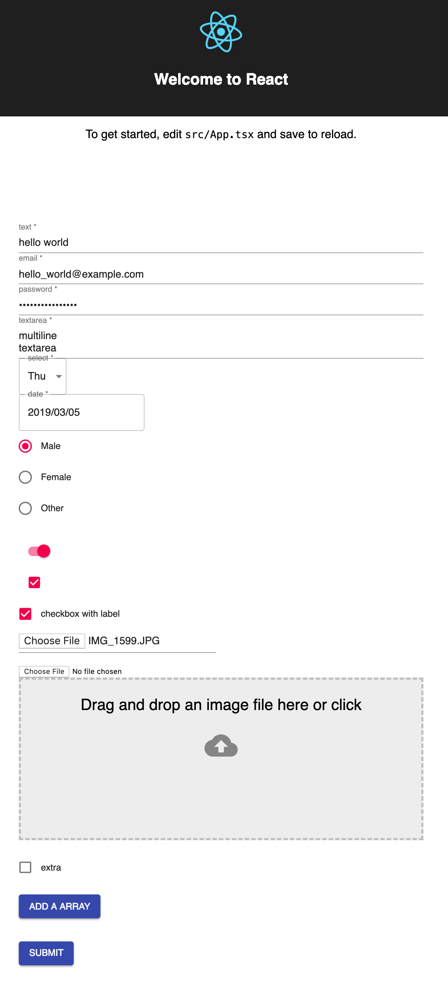

## formik mui practice

### Plugins

- [formik](https://github.com/jaredpalmer/formik)
- [formik-material-ui](https://github.com/stackworx/formik-material-ui)
- [react-dropzone](https://github.com/react-dropzone/react-dropzone)
- [Yuvaleros/material-ui-dropzone](https://github.com/Yuvaleros/material-ui-dropzone)

### Usage

1. `yarn`
2. `yarn start`

### Screenshot

